<h2 align="left">Hi 👋! My name is Samuel and I'm a Systems Engineer from Colombia</h2>

###

<div align="center">
  
</div>

###


###

<div align="left">
  
  
  
</div>

###
## 📦 Proyecto: Simulador de Batallas Pokémon (MVC)

Este proyecto es una simulación de combates entre Pokémon utilizando Java. El sistema permite que entrenadores elijan y enfrenten Pokémon con distintos ataques y tipos (agua, fuego, psíquico y eléctrico).

### ✨ Características:
- Simulación por consola y GUI de batallas entre Pokémon.
- Sistema de ataques con nombre, poder y tipo.
- Todo esta completamente dividido en carpetas siguiendo con la estructura del MVC y algunas externas para mayor orden y entendimiento del codigo.

### 📊 Diagrama de Flujo del Sistema MVC

```mermaid
graph TD
    ControladorInicio[**ControladorInicio**<br>────────────<br>- Inicio Vista<br>- boolean ESGUI<br>────────────<br>+ public ControladorInicio<br>+ public void IniciarJuego<br>+        public void INICIAR<br>+ public void CambiarVista<br>+ public void setESGUS ] --> VistaTerminalInicio[**inicioPokemonTerminal**<br>────────────<br>- Scanner scanner<br>- ControladorInicio Controlador<br>────────────<br>+ public InicioPokemonTerminal<br>+ public void setControlador<br>+ pulic void Iniciar]
    ControladorInicio --> ControladorEntrenador
    ControladorInicio --> VistaGUIInicio[**InicioPokemon**<br>────────────<br>- javax.swing.JButton BotonJugar<br>- javax.swing.JLabel LabelFondoInicio<br>- javax.swing.JLabel LabelLogo<br>- javax.swing.JPanel PanelDeInicio<br>- javax.swing.JButton BotonTerminal<br>- void initComponents<br>────────────<br>+ ControladorInicio controlador<BR>+ InicioPokemon<BR>+ static void main<BR>+ void actionPerformed<br>+ void SetControlador<br>+ void Iniciar ]

    ControladorEntrenador[**ControladorEntrenadores**<br>────────────<br>- EntrenadoresInterface vista<br>- Entrenador entrenador1<br>-Entrenador entrenador2<br>- boolean ESGUI<br>────────────<br>+ public ControladorEntrenadores<br>+ public void iniciar<br>+ public void crearEntrenadores<br>+ public void cambiarVista<br>+public void setESGUI ] --> VistaTerminalEntrenador[**EntrenadoresTerminal**<br>────────────<br>- Scanner scanner<br>────────────<br>+ ControladorEntrenadores controlador<br>+ EntrenadoresTerminal<br>+ void setControlador<br>+ void Iniciar<br>+ void Mostrar_equipo]
    ControladorEntrenador --> ControladorSeleccionPokemon
    ControladorEntrenador --> ModeloEntrenador
    ControladorEntrenador --> VistaGUIEntrenador[**Entrenadores**<br>────────────<br>- void initComponents<br>- javax.swing.JButton BotonContinuar<br>- javax.swing.JLabel LabelEntrenador1<br>- javax.swing.JLabel LabelEntrenador2<br>- javax.swing.JLabel LabelEntrenadores<br>- javax.swing.JLabel LabelFondoEntrenadores<br>- javax.swing.JPanel PanelDeEntrenadores<br>- javax.swing.JTextField TextFieldEntrenador1<br>- javax.swing.JTextField TextFieldEntrenador2<br>- javax.swing.JButton BotonTerminal]
    ModeloEntrenador[**Modelo Entrenador**<br>────────────<br>- String nombre_entrenador<br>- ArrayList<Pokemon> equipo_entrenador<br>- byte contador_pokemones<br>────────────<br>+ String getNombre_entrenador<br>+ ArrayList<Pokemon> getEquipo_entrenador<br>+ void EliminarPokemon<br>+ Entrenador<br>+ void agregarPokemonEquipo<br>+ short randomVida<br>+ short randomDefensa<br>+ short randomVelocidad<br>+ short randomDefensaEspecial<br>+ short randomAtaque<br>+ void elegirPokemonBatallaAutomatico<br>+ void agregraAtaquesPokemonesAutomatico<br>+ void agregraAtaquesPokemonesAutomaticoEspeciales<br>+ void mostrarEquipo<br>+ static public HashMap getimagenes_front<br>+ static public HashMap getimagenes_Back<br>+ public HashMap getTipoPokemon<br>+ public HashMap getCounters<br>+ ArrayList getPokemones<br>+ void felicidad<br>+ void tristeza] --> ModeloPokemon[**Modelo Pokemon**<br>────────────<br>- String nombre<br>- ArrayList ataques<br>- TiposPokemon tipo<br>- short vida<br>- byte contadorataques<br>- TiposPokemon counter<br>────────────<br>+ short defensa<br>+ short velocidad<br>+ short defensaEspecial<br>+ short ataque<br>+ Pokemon<br>+ short getAtaque<br>+ void setAtaque<br>+ String getNombre<br>+ void setNombre<br>+ TiposPokemon getTipo<br>+ void setTipo<br>+ short getVida<br>+ void setVida<br>+ TiposPokemon getCounter<br>+ void setCounter<br>+ void addAtaque<br>+ void setAtaques<br>+ byte getContadorataques<br>+ void setContadorataques<br>+ short getDefensa<br>+ void setDefensa<br>+ short getVelocidad<br>+ void setVelocidad<br>+ short getDefensaEspecial<br>+ void setDefensaEspecial<br>+ ArrayList getAtaques<br>+ void mostrarAtaques<br>+ String toString<br>+ void atacar<br>+ void recibirDaño]

    ControladorSeleccionPokemon[**ControladorSeleccion**<br>────────────<br>- Interfaces.SeleccionPokemonInterface vista<br>- Entrenador entrenador1<br>- Entrenador entrenador2<br>- Batalla batalla<br>- boolean ESGUI<br>────────────<br>+ ControladorSeleccion<br>+ void iniciar<br>+ void InicioBatalla<br>+ void setBatalla<br>+ void cambiarVista<br>+ void setESGUI<br>+ void Desicion] --> VistaTerminalSeleccionPokemon[**SeleccionPokemonTerminal**<br>────────────<br>+ ControladorSeleccion controlador<br>+ Scanner scanner<br>+ SeleccionPokemonTerminal<br>+ void setControlador<br>+ void Iniciar<br>+ void Mensaje]
    ControladorSeleccionPokemon --> ControladorBatalla
    ControladorSeleccionPokemon --> VistaGUISeleccionPokemon[**SeleccionPokemon**<br>────────────<br>- void initComponents<br>- javax.swing.JButton BotonContinuarSeleccionPokemon<br>- javax.swing.JLabel LabelDeImagenEntrenador1<br>- javax.swing.JLabel LabelDeImagenEntrenador2<br>- javax.swing.JLabel LabelFondoSeleccionPokemon<br>- javax.swing.JLabel LabelNombreEntrenador1 <br>- javax.swing.JLabel LabelNombreEntrenador2<br>- javax.swing.JList<Pokemon> ListEntrenador1<br>- javax.swing.JList<Pokemon> ListEntrenador2<br>- javax.swing.JPanel jPanel1<br>- javax.swing.JScrollPane jScrollPane1<br>- javax.swing.JScrollPane jScrollPane3<br>- javax.swing.JButton BotonTerminal<br>────────────<br>+ ControladorSeleccion controlador<br>+ Pokemon PokemonGuardado<br>+ int ContadorEntrenadorTotal<br>+ SeleccionPokemon<br>+ static void main<br>- void actionPerformed<br>+ void setControlador<br>+ void Iniciar<br>+ void Mensaje]

    ControladorBatalla[**ControladorBatalla**<br>────────────<br>- Pokemon pokemon1<br>- Pokemon pokemon2<br>- BatallaInterface vista<br>- Batalla batalla<br>- boolean ESGUI<br>────────────<br>+ void iniciar<br>+ void atacar<br>+ Byte get_turno<br>+ Byte get_contadorAtaque1<br>+ Byte get_contadorAtaque2<br>+ void Regreso<br>+ void cambiarVista<br>+ void setESGUI<br>+ BatallaPokemon CastingVista<br>+ void MensajeTurno<br>+ String vida1 <br>+ String vida2] --> VistaTerminalBatalla[**BatallaPokemonTerminal**<br>────────────<br>+ ControladorBatalla controlador<br>+ Scanner scanner<br>+ BatallaPokemonTerminal<br>+ void setControlador<br>+ void Iniciar<br>+ void Mensaje<br>+ void Borrar]
    ControladorBatalla --> ControladorSeleccionPokemon
    ControladorBatalla --> VistaGUIBatalla[**BatallaPokemon**<br>────────────<br>- void initComponents<br>- javax.swing.JButton jButton1<br>- javax.swing.JButton jButton2<br>- javax.swing.JButton jButton3<br>- javax.swing.JButton jButton4<br>- javax.swing.JButton jButton5<br>- javax.swing.JButton jButton6<br>- javax.swing.JButton jButton7<br>- javax.swing.JButton jButton8<br>-javax.swing.JButton BotonTerminal<br>- javax.swing.JLabel jLabel1<br>- javax.swing.JLabel jLabel2<br>- javax.swing.JLabel jLabel3<br>- javax.swing.JLabel jLabel4<br>- javax.swing.JLabel jLabel5<br>- javax.swing.JLabel jLabel6<br>- javax.swing.JLabel jLabel7<br>- javax.swing.JPanel jPanel2<br>────────────<br>+ ControladorBatalla controlador<br>+ BatallaPokemon<br>+ static void main<br>+ void Ocultarbotones<br>+ void actionPerformed<br>+ void setControlador<br>+ void Iniciar<br>+ void actualizar<br>+ void Mensaje<br>+ void Borrar]
    

    
```

###


###

### 🛠️ Tecnologías
- Java ☕
- Visual Studio Code 💻

### 🚀 Cómo Ejecutar
1. Clona el repositorio:
```bash
git clone https://github.com/Alvarado007/Tercer-miniproyecto-java-MVC.git
```
2. Abre el proyecto en tu IDE favorito.
3. Asegúrate de tener Java instalado (Java 8+).
4. Ejecuta la clase `Main` (por implementar) o una clase de prueba que cree entrenadores y pokémon para simular batallas.

### 👥 Autores
- Samuel Alvarado – [GitHub](https://github.com/Alvarado007) 202459469
- Santiago Arboleda – [GitHub](https://github.com/SantiagoA0408) 202459463
- Juan Manuel Gómez – [GitHub](https://github.com/JuanManuelG26706) 202459450

### 📬 Contacto
Si quieres mejorar este proyecto o darme sugerencias, no dudes en escribirme.

<div align="left">
  
  
</div>

---

> Este es un proyecto académico con potencial para expandirse a una app con interfaz gráfica y lógica más compleja para torneos, niveles y más estrategia.
